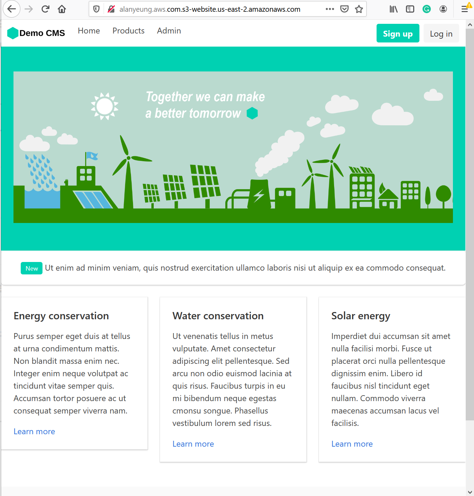
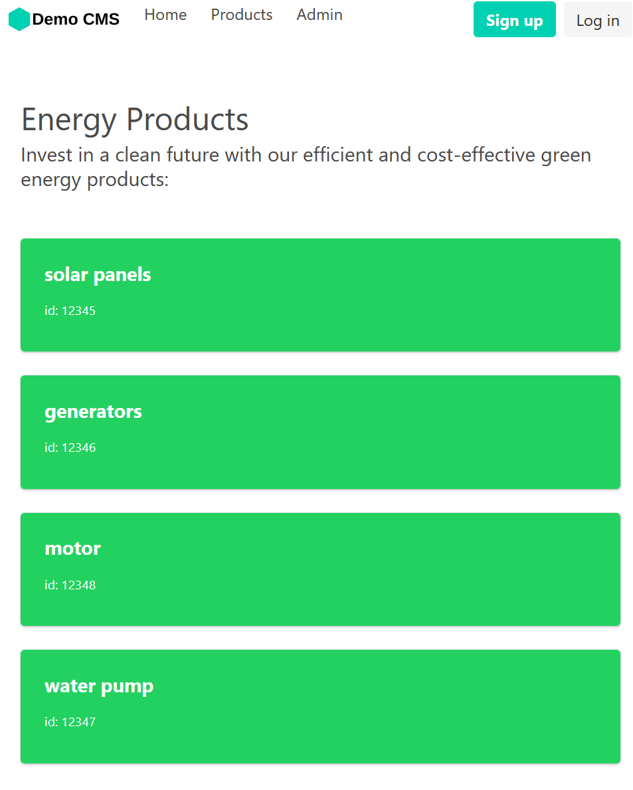
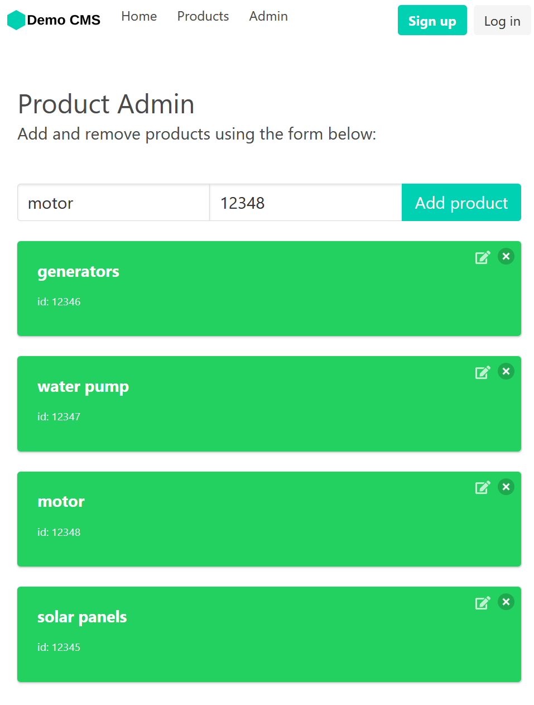
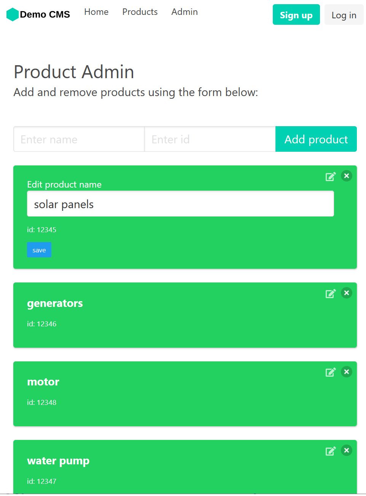

# Introduction

This is a product cms which user can perform CRUD on product content.

demo website:
http://alanyeung.aws.com.s3-website.us-east-2.amazonaws.com/

## Skill Stacking used in this project

- React.Js
- AWS API Gateway
- AWS Lambda Function & Serverless Computing
- Amazon DynamoDB
- AWS S3 bucket & Static Website Hosting

## Demo Screencap
### Home page


### List product


### Create product


### Update product & Delete product


# Todo list:

- [ ] User management
- [ ] Migrate this project from Github to AWS CodeCommit or Deploy code from github to lambda

# Development

start server

```
npm start
```

build project for uploading the static assets to s3 bucket

```
npm run build
```

## DynamoDB config

### Identify dynamodb manual actions

1. getItem
2. putItem
3. updateItem
4. deleteItem

### Add Amazon Resource Name (ARN)

```
Amazon Resource Name (ARN)	arn:aws:dynamodb:us-east-2:719537100027:table/Products
```

# Credit

The UI starter code is forked from this repo
https://github.com/jspruance/hexal-serverless-starter

And I follow these videos to learn aws serverless

https://www.youtube.com/watch?v=VGerk8hrP9U

https://www.youtube.com/watch?v=xJvfcg9dW4U&t=488s

https://www.youtube.com/watch?v=xJvfcg9dW4U

https://www.youtube.com/watch?v=P_B79xXf-w8
